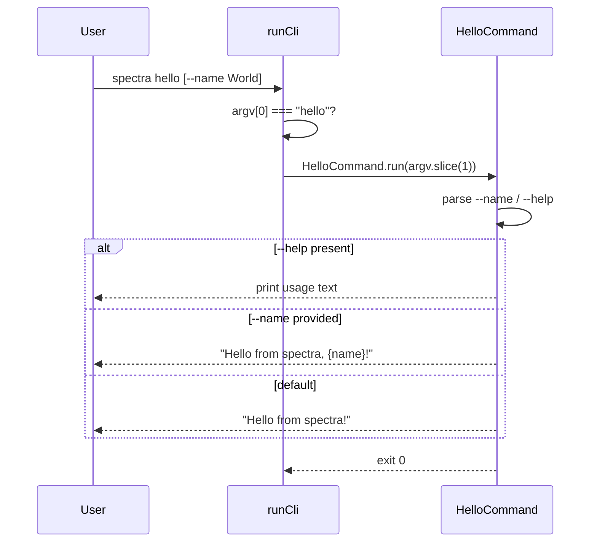

# Design Document: Hello Command

---
**Purpose**: Provide sufficient detail to implement the `spectra hello` greeting subcommand without interpretation drift.
---

## Overview

The `hello` feature adds a greeting subcommand to the spectra CLI. When a user runs `spectra hello`, they receive a friendly message. An optional `--name` flag personalizes the greeting. This is a pure side-effect-free command — no network, file I/O, or state mutation.

**Users**: All spectra CLI users discovering or testing the tool.

### Goals
- Add `spectra hello` subcommand routing to the CLI entry point
- Print greeting to stdout only, exit 0
- Support `--name`/`-n` for personalized greeting
- Support `--help` for usage info

### Non-Goals
- No network calls, file writes, or persistent state
- No internationalization or multi-language support in this iteration
- No configuration file integration

## Architecture

### Existing Architecture Analysis

The spectra CLI (`tools/spectra/src/index.ts`) is a single-command CLI that parses flags (agent, lang, os, etc.) and runs a manifest-driven plan. It uses `parseArgs` from `cli/args.ts` for argument parsing and `runCli` as the single entry point. There is no subcommand routing — `hello` would be treated as an unrecognized positional argument under the current implementation.

### Architecture Pattern

**Subcommand pattern**: Add a positional-arg check at the top of `runCli` before flag parsing. If `argv[0]` is `"hello"`, strip it and route to `HelloCommand.run(argv.slice(1))`.

### Technology Stack

| Layer | Choice | Role | Notes |
|-------|--------|------|-------|
| CLI | TypeScript / Node.js | Subcommand routing & handler | No new dependencies |
| Args | `cli/args.ts` (existing) | Parse `--name` and `--help` | Reuse existing `parseArgs` |
| Output | `cli/ui/colors.ts` (existing) | Format greeting output | Use `formatSuccess` |

## File Structure Plan

### Directory Structure
```
tools/spectra/src/
├── index.ts                    # Modified: add hello subcommand routing
├── commands/
│   └── hello.ts                # NEW: HelloCommand handler
```

### Modified Files
- `tools/spectra/src/index.ts` — Add `hello` subcommand check in `runCli` before flag parse; dispatch to `HelloCommand`

## System Flows

### CLI Dispatch Flow



## Requirements Traceability

| Req | Summary | Component | Interfaces |
|-----|---------|-----------|------------|
| 1 | Basic greeting | HelloCommand | stdout |
| 2 | Personalized greeting | HelloCommand | --name/-n flag |
| 3 | Help and usage | HelloCommand | --help flag |
| 4 | Testability | HelloCommand | All output via parameter |

## Components and Interfaces

| Component | Layer | Intent | Req Coverage | Key Dependencies | Contracts |
|-----------|-------|--------|--------------|------------------|-----------|
| HelloCommand | CLI | Handle `spectra hello` subcommand | 1, 2, 3, 4 | runCli (dispatcher) | Function |

### CLI Layer

#### HelloCommand

| Field | Detail |
|-------|--------|
| Intent | Route and handle the `spectra hello` subcommand |
| Requirements | 1, 2, 3, 4 |

**Responsibilities & Constraints**
- Parse positional args and flags (`--name`, `--help`)
- Produce greeting string as pure function (no I/O)
- Return exit code 0; let caller handle output

**Dependencies**
- Inbound: `runCli` — dispatches argv (Criticality: P0)
- Outbound: CLI IO interface for printing output

**Contracts**: Function [x] / API [ ] / Event [ ]

##### Service Interface
```typescript
export interface HelloOptions {
  name?: string;
  help?: boolean;
}

export interface HelloResult {
  exitCode: number;
  message: string;
}

export async function runHello(argv: string[], io: CliIO): Promise<number>;
```

**Implementation Notes**
- Parse `--help` first; if present, print usage and return 0
- Parse `--name <value>` or `-n <value>`
- If name is empty/whitespace, fall back to default greeting
- Use `io.log` for stdout output (already handles TTY detection)
- Pure function: no side effects, no file/network I/O

## Error Handling

### Error Strategy

- Invalid `--name` with missing value → show error message + usage hint, exit 1
- Unknown flags → show error message + usage hint, exit 1

### Error Categories and Responses
- **User Errors** (4xx): Missing `--name` value → "Error: --name requires a value\n\nUsage: ..."
- **System Errors**: None (no I/O operations)

## Testing Strategy

- **Unit Tests** (3 items):
  - `runHello([])` returns default greeting `"Hello from spectra!"`
  - `runHello(["--name", "World"])` returns `"Hello from spectra, World!"`
  - `runHello(["--help"])` returns usage text
- **Edge Cases** (3 items):
  - `runHello(["-n", ""])` falls back to default greeting
  - `runHello(["--name"])` (missing value) returns error + usage
  - `runHello(["--unknown"])` returns error + usage
